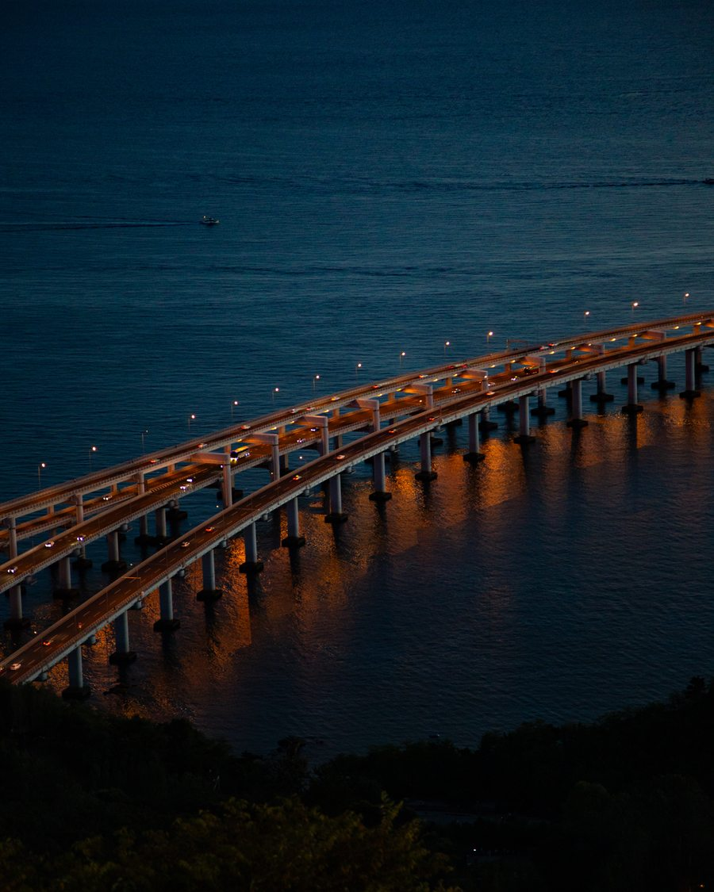
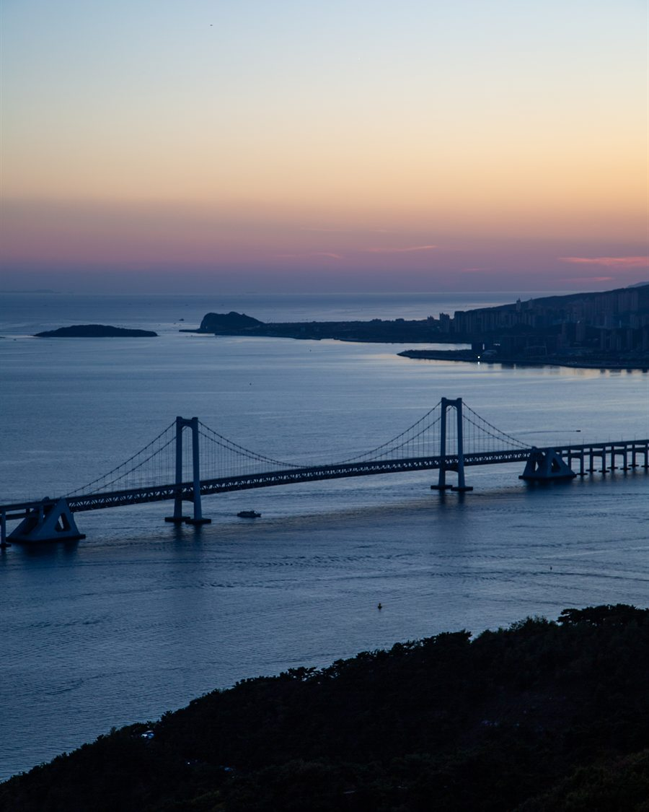
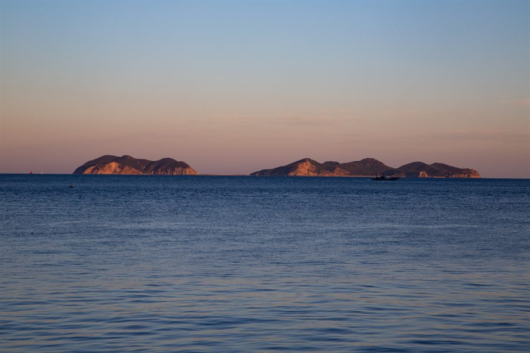
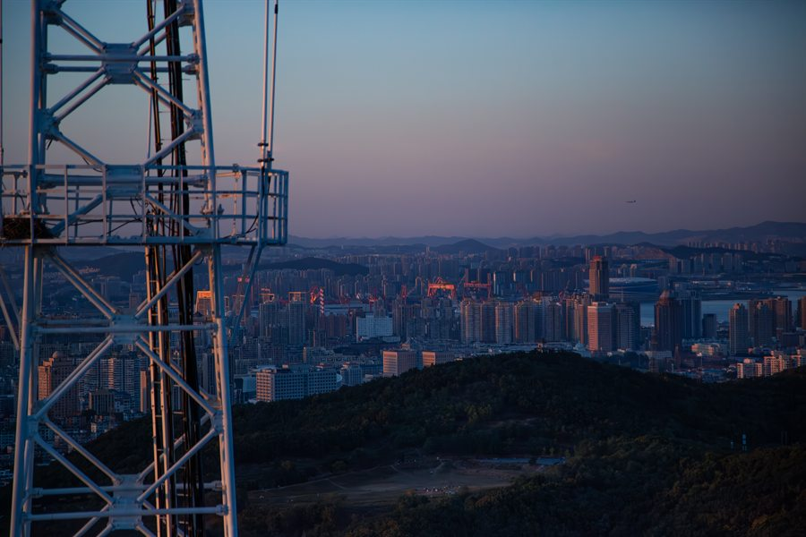

  <picture>
    <source media="(prefers-color-scheme: dark)" srcset="./assets/hero-gradient-dark.jpg">
    <source media="(prefers-color-scheme: light)" srcset="./assets/hero-gradient-light.jpg">
    
  </picture>

  <h1>ScyPolit</h1>
  
<strong>Full-Stack Engineer · 全栈工程师</strong>

  
从界面到基础设施，把复杂问题变成清晰、可靠、优雅的产品。

  
<em>Build thoughtfully. Ship reliably.</em>

  

    
    
    
  

   

  <h2>关于我</h2>

  

    🧭 关注产品从体验、架构、数据到交付的完整链路 
    🧩 喜欢清晰的边界、恰当的抽象与可维护的系统 
    🌱 持续学习，也持续把想法沉淀为真实作品 
    ⛰️ 热爱山海与摄影，相信软件也应像山一样可靠、像水一样灵活
  

   

  <h2>能力版图</h2>

  

    
    
  

  

    
    
  

   

  <h2>工程理念</h2>

  

    <strong>清晰胜过炫技</strong> · 可读的代码与明确的边界 
    <strong>体验贯穿全栈</strong> · 同时关注用户、接口与性能 
    <strong>可靠来自细节</strong> · 测试、可观测性与稳定交付
  

   

  

    
<strong>📷 山海与城市 · Through My Lens</strong>

     
    <table>
      <tr>
        <td width="50%" align="center"> 海上通途 · Connection</td>
        <td width="50%" align="center"> 蓝调时刻 · Serenity</td>
      </tr>
      <tr>
        <td width="50%" align="center"> 远山如黛 · Perspective</td>
        <td width="50%" align="center"> 城市脉络 · Systems</td>
      </tr>
    </table>
  

   
   

  行到水穷处，坐看云起时。 · 山高水长，代码不止。

